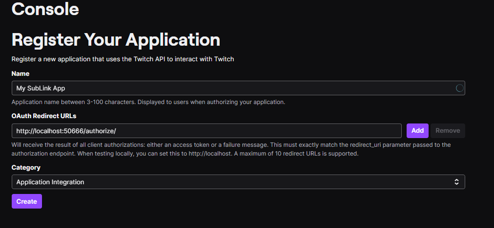
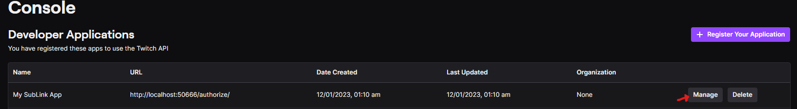
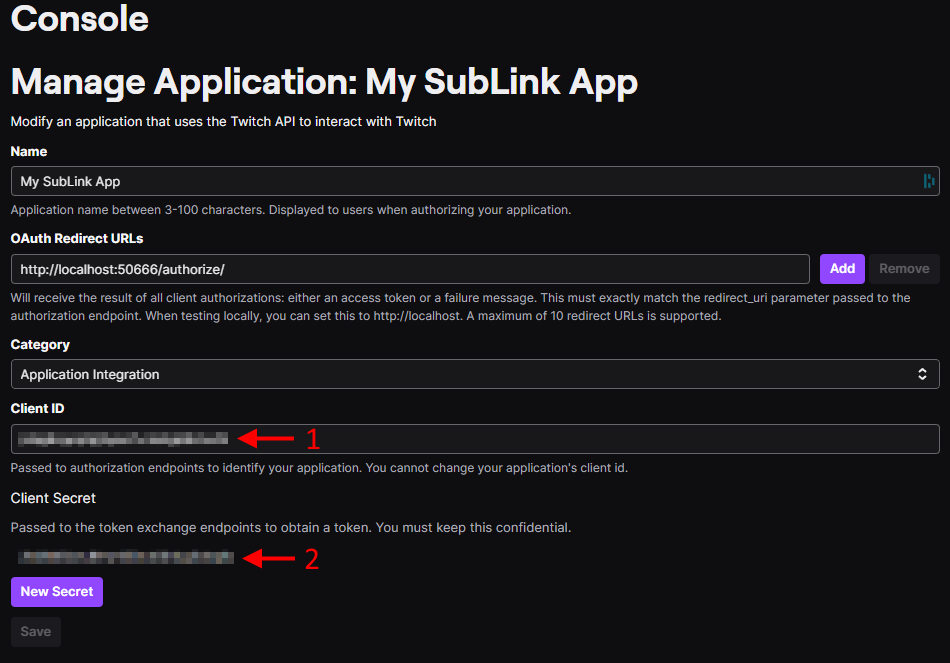

&nbsp;&nbsp;&nbsp;&nbsp;&nbsp;&nbsp;

# SubLink

SubLink is an application for creating scriptable integrations between VRChat and streaming platforms (like Twitch and Kick) through OSC. You can customize your `SubLink.cs` file (included with the build) to respond to stream events with OSC and more.

## Special Thanks

A big thank you to [CatGirlEddie](https://www.twitch.tv/catgirleddie), my collaborator on the avatar side of SubLink, for her invaluable contributions and expertise to SubLink-compatible avatar creation.

## Discord

If you need help, feel free to reach out on Twitter or on Discord!

## Featured Streamers

[SubLink](https://github.com/yewnyx/SubLink) for Twitch is used by the following notable streamers (and more):

- [Roflgator](https://www.twitch.tv/roflgator)
- [MurderCrumpet](https://www.twitch.tv/murdercrumpet)
- [Aeriy](https://www.twitch.tv/aeriy)
- [MikaMoonlight](https://www.twitch.tv/mikamoonlight)

## Status
SubLink is currently very stable, and has been for over a year. I'm hitting pause on my personal contributions due to time constraints, but I'm not going anywhere, and can provide updates to resolve stability issues, or offer feedback on any contributions to SubLink as a whole. I would welcome contributions from the community; additional collaborators are encouraged and appreciated.

CatGirlEddie remains actively involved with and the foremost expert on creating and integrating SubLink features and animations into avatars.

## Setup (Twitch)

1. On the first run, the application will create a `settings.json` file.
2. Add your `clientid` and `clientsecret` obtained from your Twitch Developer account (or provided to you by CatGirlEddie to the `settings.json` file).  
If you prefer setting this up yourself, see the [Twitch Auth](#twitch-auth) section
3. On the second run, the application will automatically authorize through Twitch and save an access token and refresh token to `settings.json`.

```json
{
  "Clientid": "your-client-id",
  "Clientsecret": "your-client-secret"
}
```

## Setup (Kick)

1. On the first run, the application will create a `settings.json` file.
2. Retrieve your Chatroom ID, using an in-private browser, from the following URL: https://kick.com/api/v2/channels/YOUR_USER_NAME/chatroom
3. Add the `PusherKey` and `PusherCluster` settings provided to you in `settings.json`. If you don't have these, you may need to sign up for a developer account.
4. Add the numbers behind `id` in your browser to the `settings.json` file's `ChatroomId` setting.
5. On the second run, the application will automatically connect to Kick's event API and start receiving events.

```json
{
  "ChatroomId": "your-chatroom-id"
}
```

### Kick Events and data types

For more information on the events see [Kick_Events.md](Docs/Kick_Events.md)

For more information on the data types see [Kick_Types.md](Docs/Kick_Types.md)

## Setup (StreamElements)

1. On the first run, the application will create a `settings.json` file.
2. Retrieve your JWT Token, using your browser, from the following URL: https://streamelements.com/dashboard/account/channels
3. Add the `JWT Token` in your browser to the `settings.json` file's `JWTToken` setting.
4. On the second run, the application will automatically connect to StreamElements' real-time API and start receiving events.

```json
{
  "JWTToken": "your-jwt-token-that-is-super-long"
}
```

## Setup (Fansly)

1. On the first run, the application will create a `settings.json` file.
2. Retrieve your Token, using your browser.
   1. Go to the Fansly website.
   2. Open the devtools (`F12` or `right-click`>`inspect element`).
   3. Open the `Network` tab in the devtools.
   4. Search for `method:GET api`, refresh the page and click on one of the requests ending in `ngsw-bypass=true`.
   5. Look at the `Request Headers` and find the `Authorization:` line, copy the value behind it.  
  

3. Add the `Authorization:` value in your browser to the `settings.json` file's `Token` setting.
4. Add your username to the `settings.json` file's `Username` setting.
5. On the second run, the application will automatically connect to Fansly' real-time API and start receiving events.

```json
{
  "Token": "your-fansly-token",
  "Username": "your-username"
}
```

### Fansly Events and data types

For more information on the events see [Fansly_Events.md](Docs/Fansly_Events.md)

For more information on the data types see [Fansly_Types.md](Docs/Fansly_Types.md)

## Adding Support to Avatars

To add support for SubLink integrations to your VRChat avatars, I recommend using VRChat's avatar parameter drivers to increment an avatar parameter. For instance, when gift subs or bits come in, OSC will set an avatar parameter such as `TwitchCommunityGift` or `TwitchCheer` to the number gifted or cheered.

You can then create an animator layer with a resting state that transitions to a state with a parameter driver using the respective avatar parameter (e.g., `ExplosionQueue`). This animator layer will increment an internal parameter accordingly and reset the (OSC-set) avatar parameter to zero, allowing for manual radial menu fallback triggers.

From there, you can enqueue animations as needed based on the secondary parameters incremented by the parameter driver.

Default parameters can be found here: [Default_Params.md](Docs/Default_Params.md)

## Twitch Auth

If you prefer setting Twitch up yourself without our assistance, please follow the following steps:

1. Using your browser, navigate to the [Twitch Developer Console](https://dev.twitch.tv/console)
2. Register a new `Application`
3. Give it a fitting `Name` like `My SubLink App`, add `http://localhost:50666/authorize/` as `OAuth Redirect URL` and set the `Category` to `Application Integration`  

4. Click `Manage` behind the newly generated application  

5. Copy the `Client ID` (1) into your `settings.json`
6. Click `New Secret`, confirm the pop-up and copy the generated value (2) into your `settings.json`  


## Support

If you encounter any issues or need assistance, please open an issue in the project repository.

## Contributing

Contributions are welcome! If you have a feature idea, bug fix, or improvement, feel free to create a pull request or open an issue.

## Roadmap
Please note that the following roadmap represents the original plans for SubLink before it was put into maintenance mode.

1. **Cross-avatar coordination**: Implement a server component to facilitate interactions between avatars. This feature is not open-sourced, though some progress has been made in its development.
2. **Plugin system**: Develop a plugin system to extend SubLink's functionality and dynamically load assemblies that extend `SubLink.cs` capabilities.
3. **Support for other games**: Expand SubLink's capabilities to include integrations with other games.


## License

SubLink is released under the [MIT License](https://opensource.org/licenses/MIT).
