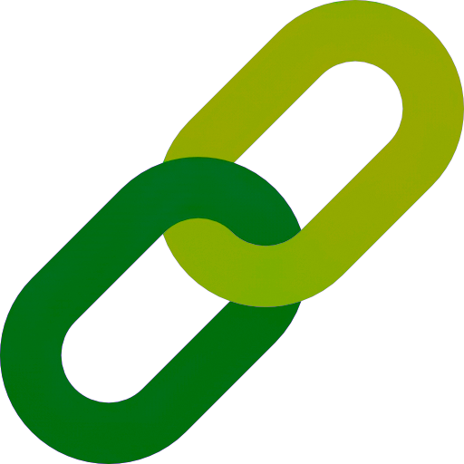
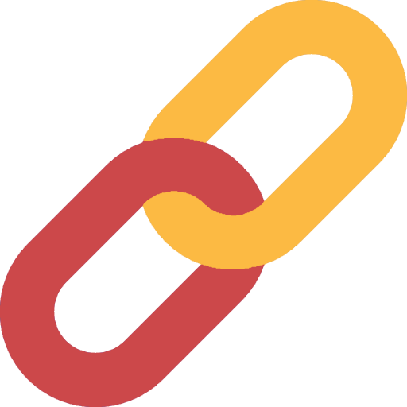
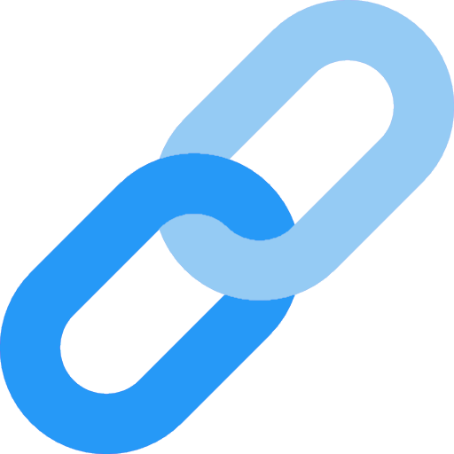

&nbsp;&nbsp;&nbsp;&nbsp;&nbsp;&nbsp;

# SubLink

SubLink is an application for creating scriptable integrations between VRChat and streaming platforms (like Twitch and Kick) through OSC. You can customize your `SubLink.cs` file (included with the build) to respond to stream events with OSC and more.

## Special Thanks

A big thank you to [CatGirlEddie](https://www.twitch.tv/catgirleddie), my collaborator on the avatar side of SubLink, for her invaluable contributions and expertise to SubLink-compatible avatar creation, and to LauraRozier, without whom the additional support for Kick, StreamElements, and other services would not be possible.

## Discord

If you need help, feel free to reach out on Twitter or on Discord!

## Featured Streamers

[SubLink](https://github.com/yewnyx/SubLink) for Twitch is used by the following notable streamers (and more):

- [Roflgator](https://www.twitch.tv/roflgator)
- [MurderCrumpet](https://www.twitch.tv/murdercrumpet)
- [Aeriy](https://www.twitch.tv/aeriy)
- [MikaMoonlight](https://www.twitch.tv/mikamoonlight)

## Status

SubLink is currently very stable, and has been for over a year. I'm hitting pause on my personal contributions due to time constraints, but I'm not going anywhere, and can provide updates to resolve stability issues, or offer feedback on any contributions to SubLink as a whole. I would welcome contributions from the community; additional collaborators are encouraged and appreciated.

CatGirlEddie remains actively involved with and the foremost expert on creating and integrating SubLink features and animations into avatars.

## Setup

- [Twitch Setup](Docs/Setup/Twitch.md)
- [Kick Setup](Docs/Setup/Kick.md)
- [Fansly Setup](Docs/Setup/Fansly.md)
- [StreamElements Setup](Docs/Setup/StreamElements.md)

## Data Types

- [Twitch Data Types](Docs/DataTypes/Twitch/Index.md)
- [Kick Data Types](Docs/DataTypes/Kick/Index.md)
- [Fansly Data Types](Docs/DataTypes/Fansly/Index.md)
- [StreamElements Data Types](Docs/DataTypes/StreamElements/Index.md)
- [StreamPad Data Types](Docs/DataTypes/StreamPad/Index.md)

## Adding Support to Avatars

To add support for SubLink integrations to your VRChat avatars, I recommend using VRChat's avatar parameter drivers to increment an avatar parameter. For instance, when gift subs or bits come in, OSC will set an avatar parameter such as `TwitchCommunityGift` or `TwitchCheer` to the number gifted or cheered.

You can then create an animator layer with a resting state that transitions to a state with a parameter driver using the respective avatar parameter (e.g., `ExplosionQueue`). This animator layer will increment an internal parameter accordingly and reset the (OSC-set) avatar parameter to zero, allowing for manual radial menu fallback triggers.

From there, you can enqueue animations as needed based on the secondary parameters incremented by the parameter driver.

Default parameters can be found here: [Default_Params.md](https://github.com/yewnyx/SubLink/blob/master/Docs/Default_Params.md)

## Support

If you encounter any issues or need assistance, please open an issue in the project repository.

## Contributing

Contributions are welcome! If you have a feature idea, bug fix, or improvement, feel free to create a pull request or open an issue.

## Roadmap

Please note that the following roadmap represents the original plans for SubLink before it was put into maintenance mode.

1. **Cross-avatar coordination**: Implement a server component to facilitate interactions between avatars. This feature is not open-sourced, though some progress has been made in its development.
2. **Plugin system**: Develop a plugin system to extend SubLink's functionality and dynamically load assemblies that extend `SubLink.cs` capabilities.
3. **Support for other games**: Expand SubLink's capabilities to include integrations with other games.

## License

SubLink is released under the [MIT License](https://opensource.org/licenses/MIT).
